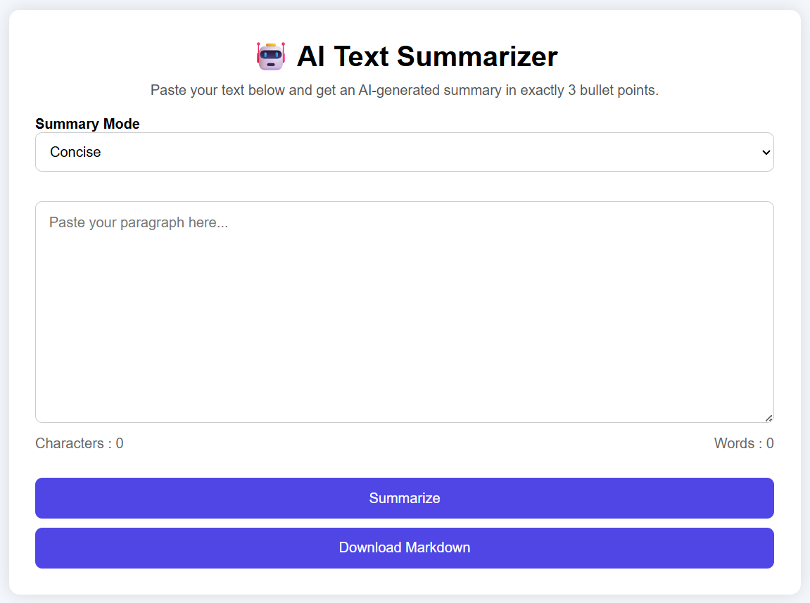
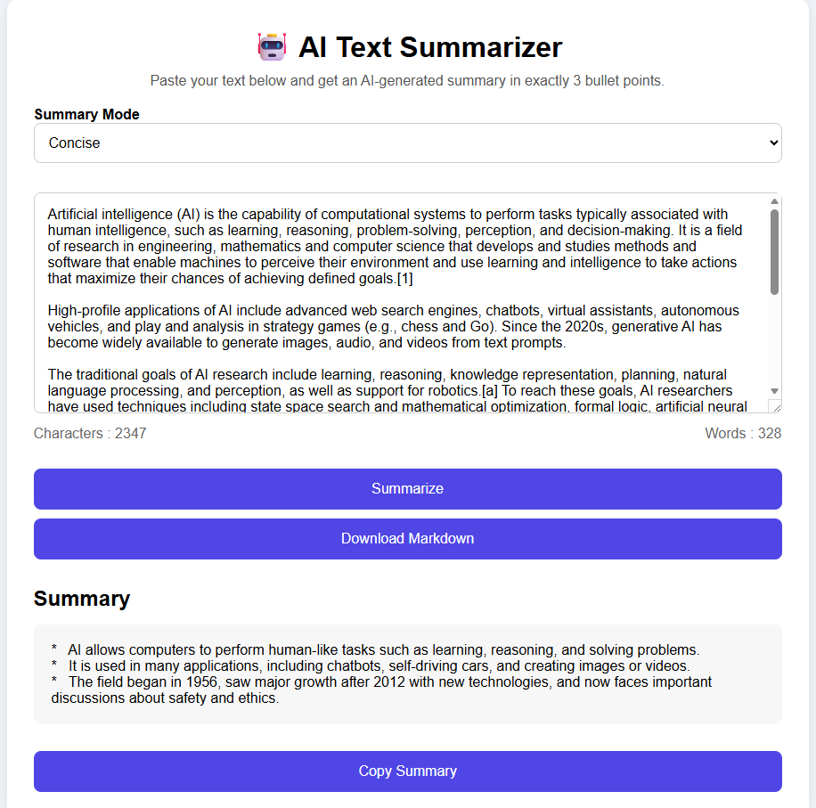
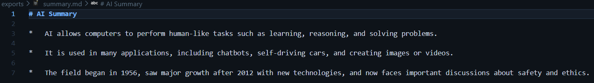

# 🤖 AI Text Summarizer

An AI-powered Text Summarizer built using **Python**, **Flask**, and **Google Gemini API**. This application allows users to paste any text and generate an AI-powered summary in different styles such as Concise, Detailed, Technical, and Executive.

This project was developed as part of the **Engineering Intern (Python / AI) Assignment 2026**.

---

# 🚀 Features

* AI-powered text summarization using Google Gemini API
* Four summary modes:

  * Concise
  * Detailed
  * Technical
  * Executive
* User-friendly web interface built with Flask
* Character Counter
* Word Counter
* Loading Indicator
* Copy Summary to Clipboard
* Download Summary as Markdown (.md)
* Input Validation
* Error Handling for API failures

---

# 🛠️ Tech Stack

* Python 3
* Flask
* Google Gemini API
* HTML5
* CSS3
* JavaScript
* python-dotenv

---

# 📂 Project Structure

```text
AI-Text-Summarizer/
│
├── app.py
├── requirements.txt
├── .env
├── .gitignore
│
├── templates/
│     └── index.html
│
├── static/
│     ├── style.css
│     └── script.js
│
└── exports/
      └── summary.md
```

---

# ⚙️ Installation

## Clone Repository

```bash
git clone https://github.com/Nandanjha1/AI-Text-Summarizer.git
```

```bash
cd AI-Text-Summarizer
```

---

## Create Virtual Environment

Windows

```bash
python -m venv venv
```

Activate

```bash
venv\Scripts\activate
```

---

## Install Dependencies

```bash
pip install -r requirements.txt
```

---

# 🔑 Configure Gemini API

Create a `.env` file in the project root.

```env
GEMINI_API_KEY=YOUR_API_KEY
```

You can generate a free Gemini API key from Google AI Studio.

---

# ▶️ Run the Project

```bash
python app.py
```

Open your browser and visit:

```
http://127.0.0.1:5000
```

---

# 📖 How to Use

1. Paste any paragraph into the text area.
2. Select a summary mode.
3. Click **Summarize**.
4. View the generated summary.
5. Copy the summary or download it as a Markdown file.

---

# 📸 Application Screenshots

### 🏠 Home Page

This is the main interface where users can paste text and choose the summary mode.



---

### 🤖 AI Generated Summary

The application generates an AI-powered summary based on the selected summary mode.



---

### 📥 Download Summary

Users can download the generated summary as a Markdown (.md) file.


---

# 🎯 Summary Modes

### Concise

Provides short and easy-to-read summaries.

### Detailed

Provides more informative summaries while keeping important details.

### Technical

Preserves technical concepts and terminology.

### Executive

Generates business-oriented summaries for managers and decision-makers.

---

# ⚠️ Error Handling

The application handles:

* Empty input
* Invalid API key
* Internet connectivity issues
* API exceptions

---

# 💡 Future Improvements

* PDF Export
* User Authentication
* Summary History
* Multiple AI Model Support
* Deploy on Render or Railway
* Dark Mode
* Database Integration

---

# 📚 Learning Outcomes

Through this project I learned:

* Flask routing
* REST API integration
* Prompt Engineering
* Environment variable management
* Exception handling
* Building AI-powered web applications
* Git & GitHub workflow

---

# 👨‍💻 Author

**Nandan Kumar**

MCA Student

Python | AI | Web Development

GitHub: https://github.com/Nandanjha1

---

# 📄 License

This project is created for educational and internship assignment purposes.
